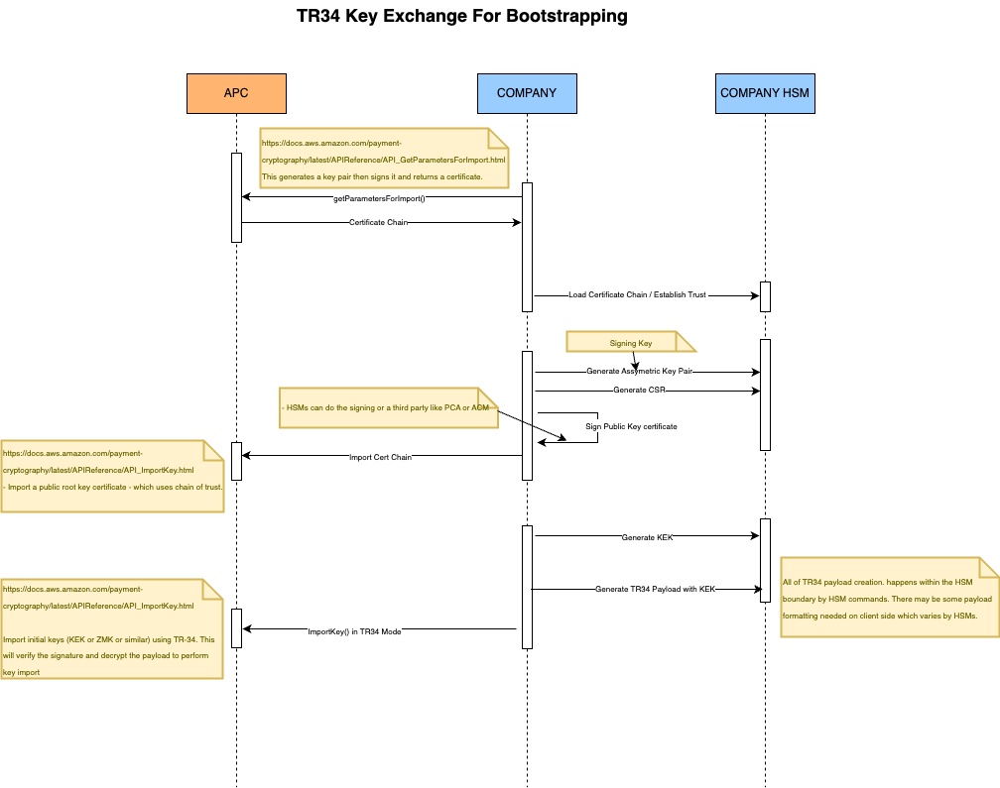
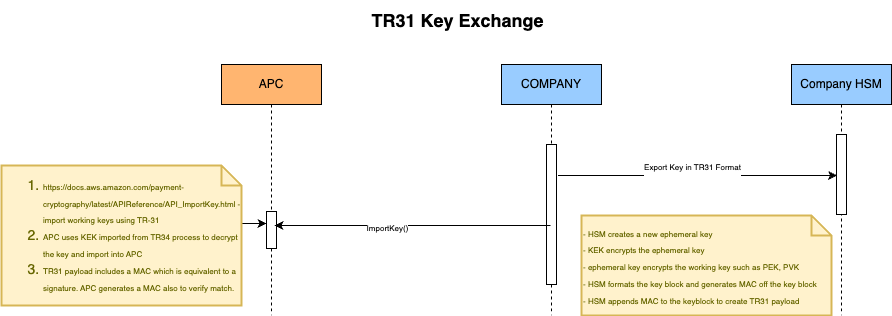

# Key Exchange Overview from HSMs to AWS Payment Cryptography Service

Following diagrams illustrate at high level the process of key exchange using TR34 for initial bootstrapping and then key exchange using TR31 of working keys.

#### TR-34 — Asymmetric key exchange protocol to setup the KEK (Key Exchange Key) in AWS Payment Cryptography Service


#### TR-31 — Symmetric key exchange protocol to setup working keys (PEK, PVK, PGK etc)


---

## Importing Clear Text Keys

Three scripts are available for importing clear text keys into AWS Payment Cryptography. Each uses a different key wrapping method. All three support providing the key either directly via `--clearkey` or by XORing three key components (`--component1`, `--component2`, `--component3`).

> **Note:** 
1. These scripts handle clear text key material and are intended for testing environments only.
2. If you only have two key components, you can enter 3rd component as all zero such as : --component3 00000000000000000000000000000000

### 1. TR-34 Import — `import_raw_key_tr34.py`

Located at: `key-import-export/tr34/import_app/import_raw_key_tr34.py`

Generates a TR-34 2012 non-CMS payload and imports it into AWS Payment Cryptography. Supports clear keys up to AES-128.

```bash
# Single clear key
python import_raw_key_tr34.py \
    --clearkey 8A8349794C9EE9A4C2927098F249FED6 \
    --algorithm T --keytype K0 --modeofuse B --exportmode E --region us-east-1

# Three key components (XORed together)
python import_raw_key_tr34.py \
    --component1 AAAABBBBCCCCDDDD1111222233334444 \
    --component2 1111222233334444AAAABBBBCCCCDDDD \
    --component3 FFFF0000FFFF00000000FFFF0000FFFF \
    --algorithm T --keytype K0 --modeofuse B --exportmode E --region us-east-1

# Random key (omit --clearkey and components)
python import_raw_key_tr34.py \
    --algorithm T --keytype K0 --modeofuse B --exportmode E --region us-east-1
```

### 2. RSA Wrap Import — `import_raw_key_rsa.py`

Located at: `key-import-export/rsa/import_app/import_raw_key_rsa.py`

Wraps a clear text key using RSA OAEP and imports it into AWS Payment Cryptography. Supports TDES (2-key, 3-key) and AES-128.

```bash
# Single clear key
python import_raw_key_rsa.py \
    --action importclearkey \
    --clearkey 6E46FE409DF704BCA75E7FF270B65E73 \
    --clearkey_algorithm A

# Three key components
python import_raw_key_rsa.py \
    --action importclearkey \
    --component1 AAAABBBBCCCCDDDD1111222233334444 \
    --component2 1111222233334444AAAABBBBCCCCDDDD \
    --component3 FFFF0000FFFF00000000FFFF0000FFFF \
    --clearkey_algorithm T

# Demo mode (generates a random key, wraps and imports it)
python import_raw_key_rsa.py --action demo
```

### 3. ECDH Import — `import_raw_key_ecdh.py`

Located at: `key-import-export/ecdh/import_app/import_raw_key_ecdh.py`

Uses Elliptic Curve Diffie-Hellman (ECDH) key agreement with TR-31 wrapping. Supports AES (128, 192, 256) and TDES keys of all lengths, making it the most flexible option.

See the [ECDH README](../ecdh/import_app/README.md) for full details.

```bash
# Single clear key (AES-256)
python import_raw_key_ecdh.py \
    --region us-east-1 --profile default \
    --clearkey 1111222233334444555566667777888811112222333344445555666677778888 \
    --key-type K0 --algorithm A --mode-of-use B --export-mode E

# Three key components
python import_raw_key_ecdh.py \
    --region us-east-1 --profile default \
    --component1 AAAABBBBCCCCDDDDEEEEFFFF11112222AAAABBBBCCCCDDDDEEEEFFFF11112222 \
    --component2 1111222233334444555566667777888811112222333344445555666677778888 \
    --component3 FFFF0000FFFF00000000FFFF0000FFFFFFFF0000FFFF00000000FFFF0000FFFF \
    --key-type K0 --algorithm A --mode-of-use B --export-mode E
```

---

## Key Component Support

All three scripts support split-knowledge key loading via three key components. When `--component1`, `--component2`, and `--component3` are provided, they are XORed together to produce the final clear key. Validation rules:

- You cannot provide both `--clearkey` and components at the same time
- All three components must be provided together
- All components must be the same hex length
