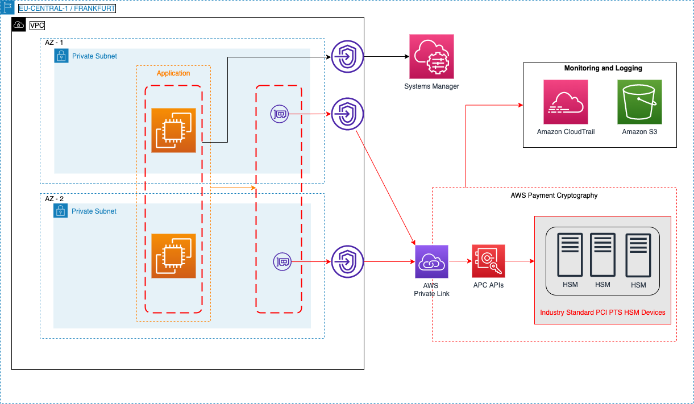

# AWS Payment Cryptography terraform-samples
This folder contains samples for [AWS Payment Cryptography](https://aws.amazon.com/payment-cryptography/) use-cases based on [HashiCorp Terraform](https://www.terraform.io/). Before exploring the use cases, ensure [service availability](https://aws.amazon.com/payment-cryptography/pricing/) in the specified AWS Region.

Using AWS Payment Cryptography (APC) simplifies your implementation of cryptographic functions and key management used to secure data in payment processing in accordance with various PCI standards. 

Learn more about [AWS for PCI standards](https://aws.amazon.com/compliance/pci-dss-level-1-faqs/) and [AWS for FSI](https://aws.amazon.com/financial-services/) 

## Use-cases

APC can be used to perform common data protection tasks for secure card payment processing. You can use APC in several common card payment processing use-cases like:

- Acquiring (Acquirer, Digital Wallet, Merchant, PSP or SoftPOS)
- Issuing (ATM Driving, Issuer and processing)
- Network and others (Network and Terminals for PSP/KIF Functionality)

In this Sample, We will cover Acquirer use case for DBK/AWK as well as Issuers use cases for CVV and PIN 

## Prerequisites

- Get familiar with AWS Payment Cryptography [documentation](https://docs.aws.amazon.com/payment-cryptography/)
- An AWS Account that will be used to create the keys
- Access to your AWS Environment and specific resources
- Terraform v.1.4.5 or later installed

## Architecture

## Terraform Resources

## Providers

| Name | Version |
|------|---------|
|  [aws](#provider\_aws) | 5.54.0 |

## Modules

| Name | Source | Version |
|------|--------|---------|
|  [acquirer](#module\_acquirer) | ./acquirer | n/a |
|  [issuer-cvv](#module\_issuer-cvv) | ./issuer-cvv | n/a |
|  [issuer-pin](#module\_issuer-pin) | ./issuer-pin | n/a |

## Resources

| Name | Type |
|------|------|
| [aws_cloudtrail.apc_trails](https://registry.terraform.io/providers/hashicorp/aws/latest/docs/resources/cloudtrail) | resource |
| [aws_iam_instance_profile.ssm_profile](https://registry.terraform.io/providers/hashicorp/aws/latest/docs/resources/iam_instance_profile) | resource |
| [aws_iam_policy.payment_cryptography_policy](https://registry.terraform.io/providers/hashicorp/aws/latest/docs/resources/iam_policy) | resource |
| [aws_iam_role.ssm_role](https://registry.terraform.io/providers/hashicorp/aws/latest/docs/resources/iam_role) | resource |
| [aws_iam_role_policy_attachment.payment_instance](https://registry.terraform.io/providers/hashicorp/aws/latest/docs/resources/iam_role_policy_attachment) | resource |
| [aws_iam_role_policy_attachment.ssm_managed_instance](https://registry.terraform.io/providers/hashicorp/aws/latest/docs/resources/iam_role_policy_attachment) | resource |
| [aws_instance.thisinstance](https://registry.terraform.io/providers/hashicorp/aws/latest/docs/resources/instance) | resource |
| [aws_s3_bucket.apc_trails_s3_bucket](https://registry.terraform.io/providers/hashicorp/aws/latest/docs/resources/s3_bucket) | resource |
| [aws_s3_bucket_policy.s3_bucket_policy](https://registry.terraform.io/providers/hashicorp/aws/latest/docs/resources/s3_bucket_policy) | resource |
| [aws_security_group.ssm_endpoint_sg](https://registry.terraform.io/providers/hashicorp/aws/latest/docs/resources/security_group) | resource |
| [aws_security_group.this](https://registry.terraform.io/providers/hashicorp/aws/latest/docs/resources/security_group) | resource |
| [aws_security_group.thissg](https://registry.terraform.io/providers/hashicorp/aws/latest/docs/resources/security_group) | resource |
| [aws_vpc_endpoint.ec2messages_endpoint](https://registry.terraform.io/providers/hashicorp/aws/latest/docs/resources/vpc_endpoint) | resource |
| [aws_vpc_endpoint.ssm_endpoint](https://registry.terraform.io/providers/hashicorp/aws/latest/docs/resources/vpc_endpoint) | resource |
| [aws_vpc_endpoint.ssmmessages_endpoint](https://registry.terraform.io/providers/hashicorp/aws/latest/docs/resources/vpc_endpoint) | resource |
| [aws_vpc_endpoint.thiscp](https://registry.terraform.io/providers/hashicorp/aws/latest/docs/resources/vpc_endpoint) | resource |
| [aws_vpc_endpoint.thisdp](https://registry.terraform.io/providers/hashicorp/aws/latest/docs/resources/vpc_endpoint) | resource |
| [aws_caller_identity.current](https://registry.terraform.io/providers/hashicorp/aws/latest/docs/data-sources/caller_identity) | data source |
| [aws_iam_policy.ssm_managed_instance](https://registry.terraform.io/providers/hashicorp/aws/latest/docs/data-sources/iam_policy) | data source |
| [aws_iam_policy_document.ec2_assume_role](https://registry.terraform.io/providers/hashicorp/aws/latest/docs/data-sources/iam_policy_document) | data source |
| [aws_iam_policy_document.payment_cryptography_policy](https://registry.terraform.io/providers/hashicorp/aws/latest/docs/data-sources/iam_policy_document) | data source |
| [aws_iam_policy_document.s3_iam_policy_document](https://registry.terraform.io/providers/hashicorp/aws/latest/docs/data-sources/iam_policy_document) | data source |
| [aws_partition.current](https://registry.terraform.io/providers/hashicorp/aws/latest/docs/data-sources/partition) | data source |
| [aws_region.current](https://registry.terraform.io/providers/hashicorp/aws/latest/docs/data-sources/region) | data source |

## Inputs

| Name | Description | Type | Default | Required |
|------|-------------|------|---------|:--------:|
|  [ami\_id](#input\_ami\_id) | The ID of the Amazon Machine Image (AMI) to use for the EC2 instance | `string` | n/a | yes |
|  [application](#input\_application) | Name of the application | `string` | n/a | yes |
|  [instance\_type](#input\_instance\_type) | The type of EC2 instance to launch | `string` | `"t2.micro"` | no |
|  [key\_name](#input\_key\_name) | Name of the EC2 key pair | `string` | n/a | yes |
|  [s3\_name](#input\_s3\_name) | S3 Bucket name for APC Log Archive | `string` | n/a | yes |
|  [subnet\_ids](#input\_subnet\_ids) | Eligible Subnets | `list(string)` | n/a | yes |
|  [trail\_name](#input\_trail\_name) | Trail name for APC Log Archive | `string` | n/a | yes |
|  [trail\_prefix](#input\_trail\_prefix) | Trail prefix name for APC Log Archive | `string` | n/a | yes |
|  [vpc\_cidr\_block](#input\_vpc\_cidr\_block) | Eligible CIDR ranges | `list(string)` | n/a | yes |
|  [vpc\_id](#input\_vpc\_id) | Customers can pass the vpc\_id here | `string` | n/a | yes |

## Outputs

No outputs.

## Security

See [CONTRIBUTING](CONTRIBUTING.md) for more information.

## License

This library is licensed under the MIT-0 License. See the [LICENSE](LICENSE) file.